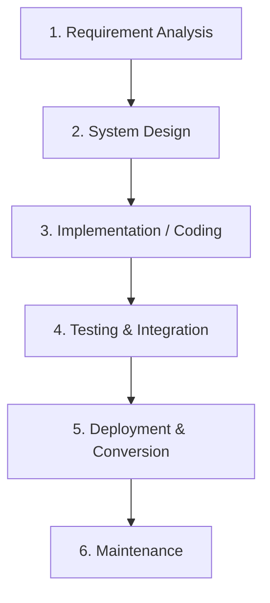
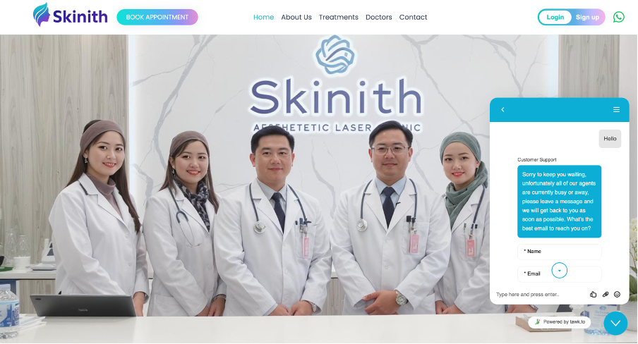

# Skinith Aesthetic Clinic - Online Appointment Booking System 🩺✨

A state-of-the-art, responsive web application designed for **Skinith Aesthetic Laser Beauty Clinic** based in Kuala Lumpur, Malaysia. This platform modernizes clinic operations by transitioning appointment scheduling from manual methods to a secure, database-driven digital system.

Developed by **Rafia Binte Rezaul** as a **Final Year Project (FYP)** under the guidance of supervisor **Thavamalar**.

---

## 📋 Table of Contents
1. [Abstract](#-abstract)
2. [Problem Statement](#-problem-statement)
3. [Key Features](#-key-features)
4. [Project Structure & File Mapping](#-project-structure--file-mapping)
5. [Software Development Methodology](#-software-development-methodology)
6. [System Design & Database Architecture](#-system-design--database-architecture)
7. [Technology Stack](#-technology-stack)
8. [System Screenshots & UI Walkthrough](#-system-screenshots--ui-walkthrough)
   - [Patient Portal (Client-Facing Pages)](#patient-portal-client-facing-pages)
   - [Doctor Dashboard](#doctor-dashboard)
   - [Administration Panel & Analytics](#administration-panel--analytics)
   - [Admin CRUD Operations](#admin-crud-operations)
9. [Installation & Local Setup](#-installation--local-setup)
10. [Security Features](#-security-features)
11. [Limitations & Future Enhancements](#-limitations--future-enhancements)
12. [Authorship & Credits](#-authorship--credits)

---

## 📝 Abstract

As client expectations evolve in the beauty and skincare industry, there is an increasing demand for convenient, efficient, and transparent service delivery. The manual appointment process (phone bookings, walk-ins, and basic email correspondence) at Skinith Aesthetic Laser Clinic frequently resulted in scheduling conflicts, administrative inefficiencies, and limited accessibility for clients. 

The **Skinith Online Appointment Booking System** solves these challenges by providing a secure, web-based platform. Clients can register, view available specialists, select appointment slots dynamically in real-time, and receive automated email notifications. For clinic staff and administrators, the system provides a centralized control center to manage schedules, appointments, and doctors.

---

## ⚠️ Problem Statement

Skinith Aesthetic Laser Beauty Clinic previously relied on manual booking and scheduling records. This approach resulted in:
* **Administrative Burden:** Staff members spending substantial time managing phone calls and paper registers, leading to human scheduling conflicts and double bookings.
* **Lack of Visibility:** Limited client accessibility to check real-time availability of specialists or treatment details outside clinic operating hours.
* **Communication Gaps:** Missing automated confirmations and reminders, leading to higher client no-show rates.
* **Loss of Competitiveness:** Falling behind modern competitors who utilize digital portals for self-service scheduling.

---

## 🚀 Key Features

### 👤 Patient Portal
* **Dynamic Slot Booking:** Real-time checking of specialist availability using AJAX without page reloads (driven by [appointment.php](file:///Applications/XAMPP/xamppfiles/htdocs/skinith1/appointment.php)).
* **Secure Registration & Auth:** Secure signup ([signUp.php](file:///Applications/XAMPP/xamppfiles/htdocs/skinith1/signUp.php)), login ([login.php](file:///Applications/XAMPP/xamppfiles/htdocs/skinith1/login.php)), session protection, and password hashing.
* **Profile Management:** Edit profile details and view history of scheduled appointments.
* **Live Support:** Integrated customer chat support directly from the homepage ([index.html](file:///Applications/XAMPP/xamppfiles/htdocs/skinith1/index.html)).
* **Email Notifications:** Instant confirmation emails sent via PHPMailer SMTP.

### 🥼 Doctor Dashboard
* **Dynamic Roster:** View all appointments assigned to the specific doctor via the secure [doctorDashboard.php](file:///Applications/XAMPP/xamppfiles/htdocs/skinith1/doctorDashboard.php).
* **Filtered Searches:** Filter appointments by client name, dates, or status.
* **Profile & Bio:** Manage doctor profile photo, specialization information, and visibility.

### 🔑 Administration Panel
* **Centralized Dashboard:** Real-time statistics showing active doctors, booked slots, and newsletter subscribers inside [adminDashboard.php](file:///Applications/XAMPP/xamppfiles/htdocs/skinith1/adminDashboard.php).
* **Appointment Management:** Complete CRUD capabilities to add ([appointmentAdd.php](file:///Applications/XAMPP/xamppfiles/htdocs/skinith1/appointmentAdd.php)), edit ([appointmentEdit.php](file:///Applications/XAMPP/xamppfiles/htdocs/skinith1/appointmentEdit.php)), and delete ([appointmentDelete.php](file:///Applications/XAMPP/xamppfiles/htdocs/skinith1/appointmentDelete.php)) appointments.
* **Doctor Management:** Add ([doctorAdd.php](file:///Applications/XAMPP/xamppfiles/htdocs/skinith1/doctorAdd.php)), edit ([doctorEdit.php](file:///Applications/XAMPP/xamppfiles/htdocs/skinith1/doctorEdit.php)), and delete ([doctorDelete.php](file:///Applications/XAMPP/xamppfiles/htdocs/skinith1/doctorDelete.php)) specialists.
* **Schedule Planner:** Set and delete doctor availability blocks and time slots using controllers like [slotAdd.php](file:///Applications/XAMPP/xamppfiles/htdocs/skinith1/slotAdd.php), [slotEdit.php](file:///Applications/XAMPP/xamppfiles/htdocs/skinith1/slotEdit.php), and [slotDelete.php](file:///Applications/XAMPP/xamppfiles/htdocs/skinith1/slotDelete.php).
* **Business Analytics:** Generate statistics and track appointments via [analytics.php](file:///Applications/XAMPP/xamppfiles/htdocs/skinith1/analytics.php).

---

## 📂 Project Structure & File Mapping

Key database settings and application logic controllers are listed below. Click on any file to navigate directly:

* ⚙️ **Configuration**:
  * [config.php](file:///Applications/XAMPP/xamppfiles/htdocs/skinith1/config.php) - Database Connection Configuration (utilizes secure variables from `.env`).
* 🌐 **Patient Portal**:
  * [index.html](file:///Applications/XAMPP/xamppfiles/htdocs/skinith1/index.html) - Homepage
  * [about.html](file:///Applications/XAMPP/xamppfiles/htdocs/skinith1/about.html) - About Us Page
  * [treatment.html](file:///Applications/XAMPP/xamppfiles/htdocs/skinith1/treatment.html) - Treatment Page
  * [contact.html](file:///Applications/XAMPP/xamppfiles/htdocs/skinith1/contact.html) - Contact Page
  * [login.php](file:///Applications/XAMPP/xamppfiles/htdocs/skinith1/login.php) / [signUp.php](file:///Applications/XAMPP/xamppfiles/htdocs/skinith1/signUp.php) - User Access and Registration
* 🥼 **Doctor Portal**:
  * [doctorDashboard.php](file:///Applications/XAMPP/xamppfiles/htdocs/skinith1/doctorDashboard.php) - Doctor Roster and Appointment Management
  * [doctorPanel.php](file:///Applications/XAMPP/xamppfiles/htdocs/skinith1/doctorPanel.php) - Doctor Navigation Hub
* 🔑 **Admin Portal**:
  * [adminDashboard.php](file:///Applications/XAMPP/xamppfiles/htdocs/skinith1/adminDashboard.php) - Main Admin Panel
  * [analytics.php](file:///Applications/XAMPP/xamppfiles/htdocs/skinith1/analytics.php) - Business and Appointment Analytics
  * [adminNav.php](file:///Applications/XAMPP/xamppfiles/htdocs/skinith1/adminNav.php) - Admin Panel Side and Top Navigation Bar

---

## ⚙️ Software Development Methodology

This project was built following the **Waterfall Model** methodology. 



* **Requirement Analysis:** Conducted surveys/questionnaires with clinic clients confirming a strong demand (over 70% dissatisfaction with manual methods) for digital booking.
* **System Design:** Formulated Use Case, Activity, and Class UML diagrams, followed by 3rd Normal Form (3NF) database schema design.
* **Implementation:** Clean, object-oriented development utilizing PHP, MySQL, CSS, and Bootstrap.
* **Testing:** Applied Black Box and White Box unit testing, followed by Integration and System acceptance tests.

---

## 📐 System Design & Database Architecture

### Use Case Diagram
The system defines interactions for three main actors: Patients, Doctors, and Administrators.
* **Patient:** Account registration, booking consultation, accessing chat support.
* **Doctor:** Viewing assigned appointments, updating patient consultation details.
* **Admin:** Complete system oversight, CRUD control over doctors, schedules, and appointments.


### Entity-Relationship Diagram (ERD)
The database structure is normalized to the **Third Normal Form (3NF)** to avoid redundancy:
* **users:** Key fields for authentication (`id`, `name`, `email`, `password`, `role`).
* **doctor:** Connects to user accounts and holds clinical profiles (`id`, `name`, `specialist`, `doctor_image`, `user_id`).
* **schedule:** Holds slots representing doctor availability (`schedule_id`, `doctor_id`, `date_time`).
* **appointments:** Connects users, doctors, and schedules together (`id`, `user_id`, `doctor_id`, `schedule_id`, `contact`, `remarks`).


---

## 🛠️ Technology Stack

| Component | Technology Used |
| :--- | :--- |
| **Frontend UI** | HTML5, CSS3, JavaScript (ES6+), Bootstrap 5 |
| **Design Libraries** | OwlCarousel (Carousels), WowJS & Animate.css (Animations), jQuery |
| **Backend Engine** | PHP (OOP & Prepared Statements) |
| **Database** | MySQL (with InnoDB tables) |
| **Email Protocol** | PHPMailer with SMTP integration |
| **Integrations** | WhatsApp Click-to-Chat API |
| **Local Environment** | XAMPP (Apache Server, PHP, MySQL) |

---

## 📸 System Screenshots & UI Walkthrough

### Patient Portal (Client-Facing Pages)

#### 🏠 Homepage & Service Sections
The homepage welcomes patients with a responsive hero section showcasing treatments, team of specialists, client reviews, and footer links.
<p align="center">
  
</p>

#### ℹ️ About Us & Treatments
Dedicated layouts explaining the clinic's background and listing cosmetic laser treatments.
<p align="center">
  
  
</p>

#### 🔬 Services & Specialist Profiles
Detailed views of dermatological services offered, alongside profiles of on-duty clinical specialists.
<p align="center">
  
  
</p>

#### 🔑 Access Portals (Login & Registration)
Secure login and signup pages for clinic patients.
<p align="center">
  
  
</p>

#### 💬 Testimonials & Footer
Client reviews and direct links to contact channels.
<p align="center">
  
  
</p>

---

### Doctor Dashboard

#### 🥼 Practitioner Interface
Doctors can access their assigned consultations, check client history, and manage their clinical schedules.
<p align="center">
  
</p>
<p align="center">
  
  
</p>

---

### Administration Panel & Analytics

#### 📊 Clinic Management & Analytics
Provides clinic administrators with dynamic statistics on active doctors, scheduled consultation slots, and analytical reports.
<p align="center">
  
  
</p>

#### 🗓️ Appointment History
A comprehensive master roster tracking all pending, approved, and historic appointments.
<p align="center">
  
</p>

---

### Admin CRUD Operations

Clinic administrators possess full CRUD controls to manage the schedule planner, doctor roster, and appointments.

#### 👥 Doctor Management
<p align="center">
  
  
  
</p>

#### 📅 Appointment Scheduling
<p align="center">
  
  
  
</p>

#### ⏰ Slot & Schedule Planner
<p align="center">
  
  
  
</p>

---

## 💻 Installation & Local Setup

### Prerequisites
* [XAMPP](https://www.apachefriends.org/) (with PHP 7.4+ or 8.x and MySQL) installed.
* Composer (optional, autoloader is already committed in the `vendor/` directory).

### Step-by-Step Setup
1. **Clone or Download the Project:**
   Extract and place the project folder inside your local server directory, e.g.:
   `/Applications/XAMPP/xamppfiles/htdocs/skinith1/`

2. **Configure Local Environment Configuration:**
   Copy the environment variables template file to `.env`:
   ```bash
   cp .env.example .env
   ```
   Open the new `.env` file and input your local database and SMTP configuration:
   ```ini
   DB_HOST=localhost
   DB_USER=root
   DB_PASS=
   DB_NAME=appointment_data

   SMTP_HOST=your_smtp_provider
   SMTP_PORT=587
   SMTP_USER=your_smtp_username
   SMTP_PASS=your_smtp_password
   ```

3. **Initialize the Database:**
   * Open XAMPP and start **Apache** and **MySQL**.
   * Open your browser and navigate to `http://localhost/phpmyadmin/`.
   * Create a new database named `appointment_data`.
   * Click **Import**, select `appointment_data.sql` (if provided, or create the tables structure shown in the ERD), and execute.

4. **Launch the System:**
   * Access the homepage in your browser: `http://localhost/skinith1/index.html`.
   * Register a new client account to test the booking flow, or log in as administrator.

---

## 🔒 Security Features

* **Prepared Statements:** Prevents SQL injection by using parameterized queries throughout PHP data actions.
* **Role-Based Access Control (RBAC):** Restricts admin routes and doctor dashboard functions from standard client access using secure session variables.
* **Credentials Hashing:** User passwords are secured using PHP's `password_hash()` (Bcrypt).
* **Secure Environment Variables:** Sensitive passwords and credentials are kept in `.env` and excluded from source control via `.gitignore`.

---

## 💡 Limitations & Future Enhancements

### Limitations
* Developed as a standalone web application; it does not currently integrate with clinical medical record systems or live patient charts.
* Lacks direct payment processing or booking fee deposits.

### Future Recommendations
* **AI Skin Analysis:** Integrate an AI-based face/skin analysis tool (using mobile camera/file upload) to diagnose basic conditions (acne, wrinkles) and suggest targeted clinic treatments.
* **Payment Gateway:** Support online payments (Stripe/PayPal) for deposits or consultation fees.
* **Calendar Sync:** Enable automatic syncing of booked appointments to Google Calendar / Outlook.
* **Dedicated Mobile App:** Build Android/iOS apps to improve client accessibility.

---

## ✍️ Authorship & Credits

* **Developer:** Rafia Binte Rezaul (Final Year Student)
* **Supervisor:** Thavamalar
* **Technologies used:** PHP, MySQL, Bootstrap, PHPMailer, jQuery
* **Project Context:** Final Year Integrated System Project (FYP).
